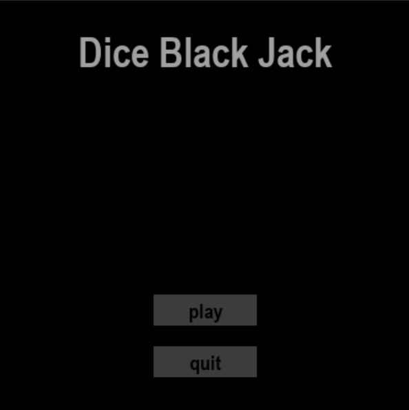
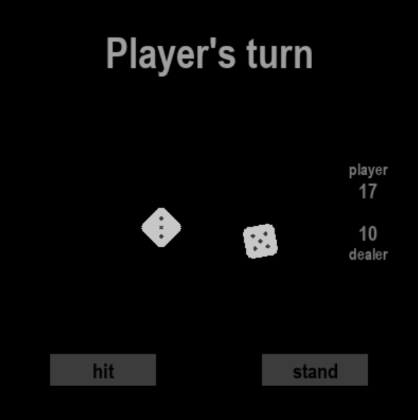
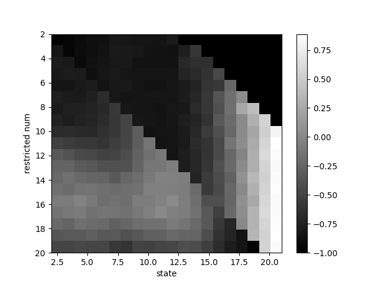

# Dice black jack
A simple double dice black jack environment used for Reinforcement Learning

- a simple graphic is included

## Installations
This project is based on python. Below are the packages that needs to be installed:

pygame
matplotlib
scipy

## Sample run
- Main  menu       
  

- In game       
  
- End screen       

- Monte carlo plot        

Shows state value function with respect to each restricted policy     

Restricted policy: hit if current state (cumulative dice sum) is less than restricted num     

Darker region means player is likely to loose on that state

  

## Files
- run_game.py      
An executable file that allows the user to interact graphically with it
- run_prompt_game.py     
An executable file interactable with prompt
- run_MC_prediction.py     
Monte Carlo simulation of restricted policy(hit until certain value, if exceed, stop)
- policy_holder.py         
Contains policies (random, restricted etc.)
- diceblackjack.py     
The dice black jack environment which takes action as input and returns observation, reward and done flag
- plotting.py     
Helper function that plots heat map
- gui.py     
Button and other GUI class
- util.py     
Image, Text, MusicBox class
- variables.py     
Some global variables
- agent.py     
TBU: RL agent

## version history

2025.04.29 Initial dice black jack environment      
2025.05.03 Error on MC estimate corrected      
2025.05.14 Prompt interaction available       
2025.05.17 Graphic is now available

TBU: RL agent

## License
Available for non-commercial use

